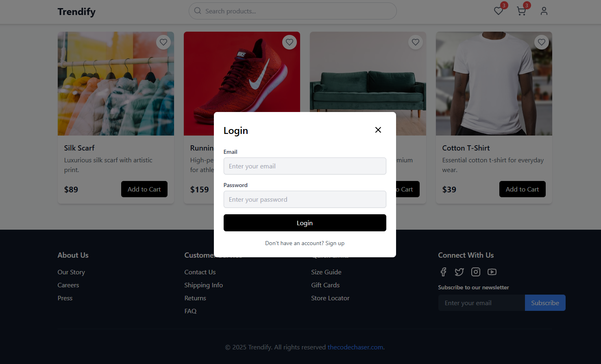
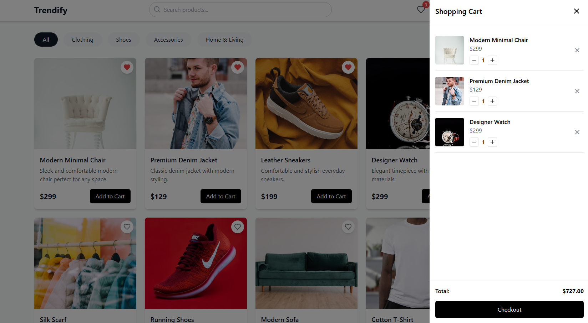

# Trendify

> Trendify is a React-based e-commerce application designed for seamless online shopping. It offers a wide range of products across categories such as clothing, shoes, and home appliances. Users can browse products, add items to their cart or wishlist, and complete their purchase effortlessly through a streamlined checkout process.

## Preview:






## Built With

- HTML
- CSS
- Tailwind
- JavaScript
- TypeScript
- REACT
- Redux
- Webpack
- Jest

## Live version

[Trendify](https://trendify-codechaser.netlify.app/)

## Getting Started

To get a local copy up and running follow these simple example steps.

### Prerequisites
- A text editor(preferably Visual Studio Code)
- Node
- Web browser

### Install
- [Git](https://git-scm.com/downloads)
- [Node](https://nodejs.org/en/download/)

### Using it Locally

- Clone the project

```bash 
git clone git@github.com:thecodechaser/trendify.git

cd trendify
```

- Install dependencies

```bash
npm i 
or
npm install
```
- To Start the development server
```bash
npm run dev
```

- To test the project
```bash
npm run test
```


## Visit And Open Files

[Visit Repo](https://github.com/thecodechaser/trendify)

## Download Repo

[Download Repo](https://github.com/thecodechaser/trendify/archive/refs/heads/main.zip)

## Authors

👤 **Ranjeet Singh**

- Website: [thecodechaser.com](https://thecodechaser.com)
- GitHub: [@thecodechaser](https://github.com/thecodechaser)
- Twitter: [@thecodechaser](https://twitter.com/thecodechaser)
- LinkedIn: [thecodechaser](https://linkedin.com/in/thecodechaser)

## 🤝 Contributing

Contributions, issues, and feature requests are welcome!

Feel free to check the [issues page](https://github.com/thecodechaser/trendify/issues).

## Show your support

Give a ⭐️ if you like this project!

## Acknowledgments

- Inspiration: Microverse

## 📝 License

This project is [MIT](./LICENSE.md) licensed.
